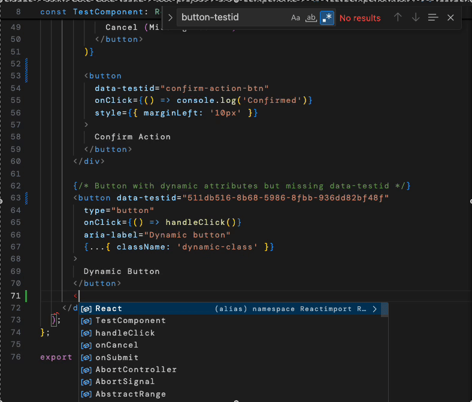

# ESLint Plugin Button TestID with Auto-Fix

An ESLint plugin that enforces `data-testid` attributes on native HTML button elements and **automatically fixes violations** by adding v5 UUID-based test IDs.



## Features

- ✅ Detects missing `data-testid` attributes on `<button>` elements
- 🔧 **Auto-fix functionality** - automatically adds v5 UUID `data-testid` attributes
- 🆔 Generates deterministic UUIDs based on button content and location
- 🎯 Works with JSX (React) and template literals
- 📱 Supports TypeScript (.tsx) and JavaScript (.jsx) files

## Quick Start Demo

Want to see the magic happen? Follow these steps:

### 1. Clone and Setup

```bash
# Clone the repository
git clone https://github.com/noodleofdeath/eslint-auto-data-testid.git
cd eslint-auto-data-testid

# Install dependencies for the plugin
cd eslint-plugin-button-testid
yarn install

# Navigate to test project
cd ../test-project
yarn install
```

### 2. Try the Auto-Fix Magic

Open the test component and add a button without `data-testid`:

```bash
# Open the test component in your editor
open src/components/TestComponent.tsx
# or use your preferred editor: code src/components/TestComponent.tsx
```

**Add a button like this anywhere in the component:**
```tsx
<button onClick={() => console.log('New button')} className="my-button">
  My New Button Without TestID
</button>
```

### 3. Run the Linter and Watch the Magic ✨

```bash
# First, see the violations detected
npx eslint src/components/TestComponent.tsx

# Now run auto-fix to see the magic happen!
npx eslint src/components/TestComponent.tsx --fix

# OR use the pre-configured lint script (recommended):
yarn lint        # See violations
yarn lint --fix  # Auto-fix violations
```

**Check the file again - your button now has a UUID data-testid automatically added!**

The button will be transformed to something like:
```tsx
<button data-testid="a1b2c3d4-e5f6-1234-abcd-123456789012" onClick={() => console.log('New button')} className="my-button">
  My New Button Without TestID
</button>
```

## Example: Before and After

**Before auto-fix:**
```tsx
<button onClick={handleClick} className="primary-button">
  Click Me
</button>
```

**After auto-fix:**
```tsx
<button data-testid="70cf5704-02bf-53e7-bc96-59f563e8697a" onClick={handleClick} className="primary-button">
  Click Me
</button>
```

## Project Structure

```
eslint-auto-data-testid/
├── eslint-plugin-button-testid/    # The ESLint plugin
│   ├── lib/
│   │   ├── index.js                # Plugin entry point
│   │   └── rules/
│   │       └── require-button-testid.js  # Main rule with auto-fix
│   └── package.json
├── test-project/                   # Test project to try the plugin
│   ├── src/components/
│   │   └── TestComponent.tsx       # Sample component with buttons
│   ├── eslint.config.js           # ESLint configuration
│   └── package.json
└── test-example.jsx               # Simple test file
```

## Installation in Your Project

1. **Install the plugin:**
```bash
npm install eslint-plugin-button-testid
# or
yarn add eslint-plugin-button-testid
```

2. **Configure ESLint:**

**ESLint 9+ (Flat Config):**
```javascript
const buttonTestIdPlugin = require('eslint-plugin-button-testid');

module.exports = [
  {
    files: ["**/*.jsx", "**/*.tsx"],
    plugins: {
      "button-testid": buttonTestIdPlugin
    },
    rules: {
      "button-testid/require-button-testid": "error"
    }
  }
];
```

**Legacy ESLint Config (.eslintrc.json):**
```json
{
  "plugins": ["button-testid"],
  "rules": {
    "button-testid/require-button-testid": "error"
  }
}
```

## Usage

### Detect Issues
```bash
npx eslint src --ext .jsx,.tsx
```

### Auto-Fix Missing TestIDs
```bash
npx eslint src --ext .jsx,.tsx --fix
```

## How the Auto-Fix Works

1. **Detection**: The plugin scans for `<button>` elements missing `data-testid` attributes
2. **UUID Generation**: Creates a deterministic v5 UUID using:
   - Button content and location as seed
   - Fixed namespace for consistency
3. **Auto-Fix**: Inserts `data-testid="<uuid>"` attribute automatically

## Why Deterministic UUIDs?

- **Consistency**: Same button location + content = same UUID across runs
- **Version Control Friendly**: No random changes in diffs
- **Testing Reliability**: Test IDs remain stable between auto-fix runs

## Troubleshooting

### Auto-fix not working?

1. **Check ESLint version compatibility** - Plugin works with ESLint 8.0.0+
2. **Verify plugin installation** - Make sure `uuid` dependency is installed alongside the plugin
3. **Check configuration** - Ensure the rule is configured with `"error"` level (not `"warn"`)

### UUIDs look different than expected?

The UUIDs are deterministic v5 UUIDs based on:
- File path and location
- Button content and attributes
- A fixed namespace

Same button in same location = same UUID every time!

## Contributing

1. Fork the repository
2. Create a feature branch
3. Make your changes
4. Test with the included test-project
5. Submit a pull request

## License

MIT License - see LICENSE file for details